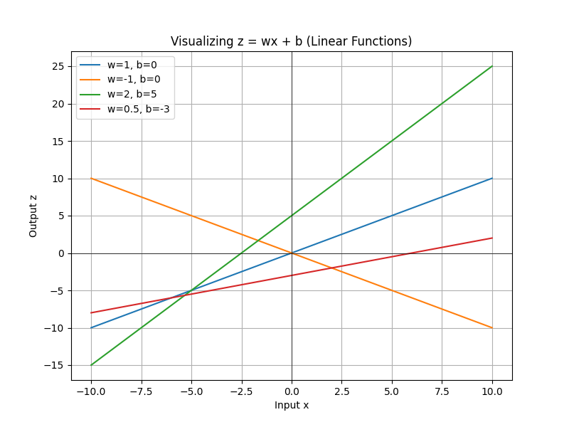
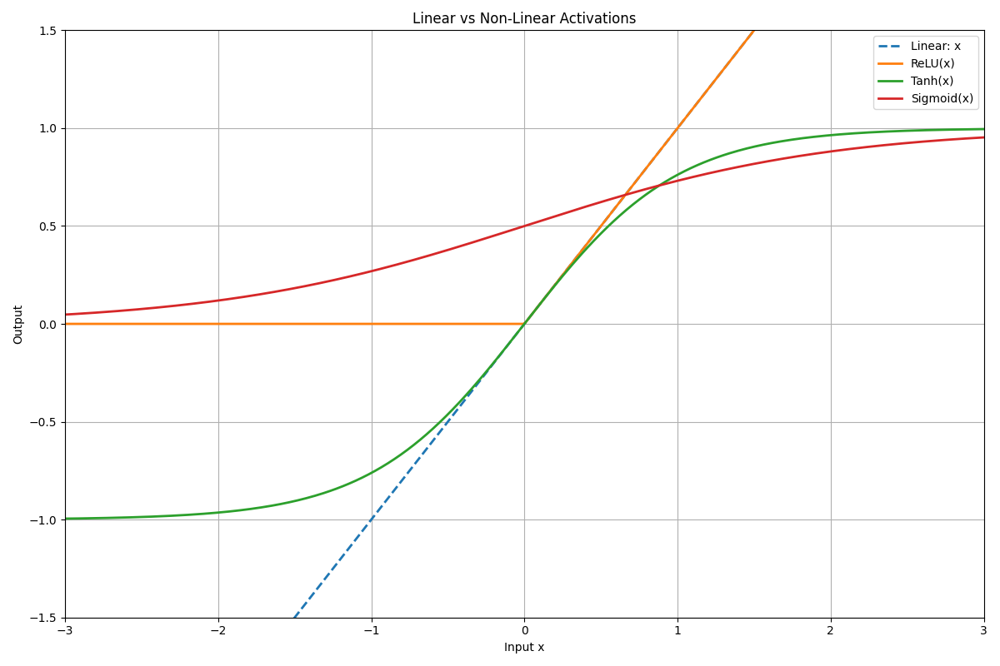
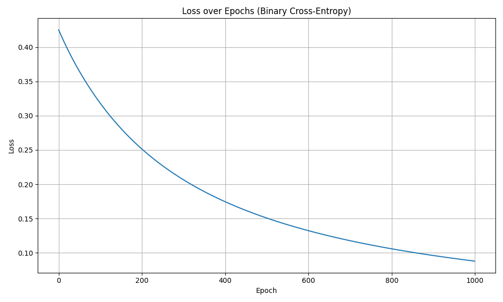

# Single Neuron Neural Network

*Published: July 2025*

---

## Introduction

Understanding neural networks starts with mastering the fundamentals. In this post, we'll explore the essence of neural networks by building and understanding a single neuron - the basic building block of all neural networks.

## What is a Neuron?

A neuron in artificial neural networks is inspired by biological neurons in the brain. It's a computational unit that:

- Receives multiple inputs
- Applies weights to these inputs  
- Sums the weighted inputs
- Applies an activation function
- Produces an output

## Mathematical Foundation

At it's core, it all boils down to one simple formula which you have known forever

$$
z = w \cdot x + b
$$

Do not worry if you don't get this, let’s break down the equation $z = w \cdot x + b$ in simple, layman terms.

### The Equation: $z = w \cdot x + b$

This is the **core calculation** every neuron in a neural network performs.

Let’s imagine this using a real-life analogy:

#### You’re buying apples and oranges.

* Suppose:

  * You buy **2 apples** and **3 oranges**.
  * The **price per apple** is ₹10.
  * The **price per orange** is ₹15.
  * And there’s a **delivery charge** of ₹5.

We calculate the total price like this:

$$
z = (2 \times 10) + (3 \times 15) + 5
$$

Which is the same as:

$$
z = w_1 \cdot x_1 + w_2 \cdot x_2 + b
$$

Where:

* $x_1, x_2$ are the **quantities** (inputs)
* $w_1, w_2$ are the **prices per unit** (weights)
* $b$ is the **fixed charge** (bias)

#### So, what is each part?

| Symbol | Meaning (Technical)          | Real-Life Analogy            |
| ------ | ---------------------------- | ---------------------------- |
| $x$    | Input values                 | Number of apples, oranges    |
| $w$    | Weight (importance of input) | Price per item               |
| $b$    | Bias (offset, base cost)     | Delivery charge or setup fee |
| $z$    | Result (weighted sum + bias) | Total cost before tax/output |

### Why Do We Do This in a Neuron?

In a neural network, we want to combine inputs and assign them importance. For example, in spam detection:

* Input: features of an email like number of links, suspicious words, etc.
* Weights: how important each feature is in deciding “spam or not”
* Bias: adjusts the output overall to fit better

By computing $z = w \cdot x + b$, we’re combining the input info and preparing it to be passed through an **activation function**, which then decides the final output (like yes/no or probability).

> **“z = w·x + b” is like calculating the total bill when buying items, where weights are prices, inputs are quantities, and bias is the fixed delivery fee. In a neuron, this helps the network decide how much each input matters before making a decision.”**

Great! Now that you understand the intuitive idea of $z = wx + b$, let’s dive into its **mathematical meaning** using the idea of **slope and intercept**, and follow it with a **Python implementation** and **visual output**.


## Mathematical View: Linear Equation

The equation:

$$
z = w \cdot x + b
$$

is just the **equation of a straight line** in 2D:

$$
y = mx + c
$$

Where:

* $x$ is the input (independent variable)
* $y$ is the output (dependent variable)
* $m$ (or $w$) is the **slope** of the line — it tells us **how steep** the line is
* $c$ (or $b$) is the **intercept** — the point where the line **crosses the y-axis**

### What do slope and intercept mean?

* If $w > 0$: The line goes **uphill** → as $x$ increases, $z$ increases
* If $w < 0$: The line goes **downhill** → as $x$ increases, $z$ decreases
* $b$: The **starting point** of the line when $x = 0$

So in a neural network, the neuron is **drawing a straight line**, and based on which side of the line the data lies, it classifies inputs.

## Python Code: Plotting $z = wx + b$

Let’s write code to visualize different lines based on varying slope and intercept.

```python
import numpy as np
import matplotlib.pyplot as plt

# Input values (x-axis)
x = np.linspace(-10, 10, 100)

# Example weights and biases
lines = [
    {"w": 1, "b": 0, "label": "w=1, b=0"},
    {"w": -1, "b": 0, "label": "w=-1, b=0"},
    {"w": 2, "b": 5, "label": "w=2, b=5"},
    {"w": 0.5, "b": -3, "label": "w=0.5, b=-3"},
]

# Plotting
plt.figure(figsize=(8, 6))
for line in lines:
    w = line["w"]
    b = line["b"]
    y = w * x + b
    plt.plot(x, y, label=line["label"])

plt.title("Visualizing z = wx + b (Linear Functions)")
plt.xlabel("Input x")
plt.ylabel("Output z")
plt.axhline(0, color='black', linewidth=0.5)
plt.axvline(0, color='black', linewidth=0.5)
plt.grid(True)
plt.legend()
plt.show()
```



Here you can see **four different lines** on a 2D plot, each one with different slope (`w`) and intercept (`b`). You can see how changing the values of `w` and `b` values affects the angle and vertical shift of the line.

## Non-Linearity and why do we need them?

If we stack multiple layers of neurons **without non-linearity**, we’re just doing:

$$
z = w_3 (w_2 (w_1 x + b_1) + b_2) + b_3
$$

This looks complicated, but it's just a fancy way of multiplying and adding — it's still a **linear function**.

It's important to understand the fact that:

> A bunch of linear functions composed together is still just another linear function.

So no matter how deep the network is, if we don't introduce non-linearity, it can only learn **straight lines**. That’s not enough to solve complex problems.

### Analogy: Roads and Turns

Imagine you’re driving from one city to another:

* **Linear function** is like driving only in a **straight line**.
* You can only go forward or backward — no turns.

But the real world has:

* Mountains
* Traffic
* Curves

To navigate that, you need **turns** — that’s **non-linearity**.

> Non-linear activation functions give the network the ability to “turn,” curve, and adapt to complex paths.

### Mathematical Explanation

Let’s say we have:

* An input $x$
* We apply a weight and bias: $z = wx + b$
* And we don’t apply any activation (i.e., it stays linear)

Then no matter how many layers we add:

$$
y = w_3(w_2(w_1 x + b_1) + b_2) + b_3
\Rightarrow y = W x + B
$$

Still linear.

#### Now Add a Non-Linear Function

Apply a non-linear activation like ReLU, Sigmoid, or Tanh after each layer:

$$
z = \sigma(w x + b)
$$

Now you’re **no longer limited to straight lines**. You can model:

* Curves
* Bends
* Complex shapes
* Any arbitrary decision boundary

### Types of Non-Linear function (also called activation functions)

Here's a structured list of the most commonly used **activation functions**, including:

#### 1. **Sigmoid**

Used in binary classification tasks. Maps input to range (0, 1). Smooth and differentiable.

$$
\sigma(z) = \frac{1}{1 + e^{-z}}
$$

```python
def sigmoid(z):
    return 1 / (1 + np.exp(-z))
```

$$
\sigma'(z) = \sigma(z)(1 - \sigma(z))
$$


#### 2. **Tanh (Hyperbolic Tangent)**

Similar to sigmoid but outputs between (-1, 1). Preferred in hidden layers over sigmoid due to zero-centered output.

$$
\tanh(z) = \frac{e^z - e^{-z}}{e^z + e^{-z}}
$$

```python
def tanh(z):
    return np.tanh(z)
```

$$
\tanh'(z) = 1 - \tanh^2(z)
$$


#### 3. **ReLU (Rectified Linear Unit)**

Most widely used. Introduces sparsity, avoids vanishing gradients for positive values. Outputs 0 for negative inputs.

$$
\text{ReLU}(z) = \max(0, z)
$$


```python
def relu(z):
    return np.maximum(0, z)
```

$$
\frac{d}{dz} \text{ReLU}(z) = 
\begin{cases}
1 & \text{if } z > 0 \\
0 & \text{otherwise}
\end{cases}
$$

#### 4. **Leaky ReLU**

Fixes the “dying ReLU” problem by allowing a small gradient when $z < 0$.

$$
\text{LeakyReLU}(z) = 
\begin{cases}
z & \text{if } z > 0 \\
\alpha z & \text{otherwise}
\end{cases}
\quad \text{where } \alpha \ll 1
$$

```python
def leaky_relu(z, alpha=0.01):
    return np.where(z > 0, z, alpha * z)
```

$$
\frac{d}{dz} \text{LeakyReLU}(z) = 
\begin{cases}
1 & \text{if } z > 0 \\
\alpha & \text{otherwise}
\end{cases}
$$

#### 5. **Softmax**

Used in the output layer for multi-class classification. Converts raw logits into probabilities that sum to 1.

$$
\text{Softmax}(z_i) = \frac{e^{z_i}}{\sum_{j} e^{z_j}}
$$

```python
def softmax(z):
    exp_z = np.exp(z - np.max(z))  # Stability fix
    return exp_z / np.sum(exp_z)
```

#### 6. **ELU (Exponential Linear Unit)**

Improves learning characteristics by smoothing the negative part of ReLU.

$$
\text{ELU}(z) = 
\begin{cases}
z & \text{if } z > 0 \\
\alpha(e^z - 1) & \text{if } z \leq 0
\end{cases}
$$

```python
def elu(z, alpha=1.0):
    return np.where(z > 0, z, alpha * (np.exp(z) - 1))
```


#### Visual Example in Code

Let’s compare a **linear** vs **non-linear** model on a simple 1D input:

```python
import numpy as np
import matplotlib.pyplot as plt

# Input range
x = np.linspace(-3.5, 3.5, 500)

# Linear function
linear = x

# Activation functions
def sigmoid(z):
    return 1 / (1 + np.exp(-z))

def tanh(z):
    return np.tanh(z)

def relu(z):
    return np.maximum(0, z)

# Apply activations to linear transformation
z = linear
sigmoid_output = sigmoid(z)
tanh_output = tanh(z)
relu_output = relu(z)

# Plot
plt.figure(figsize=(12, 8))
plt.plot(x, linear, label='Linear: x', linestyle='--', linewidth=2)
plt.plot(x, relu_output, label='ReLU(x)', linewidth=2)
plt.plot(x, tanh_output, label='Tanh(x)', linewidth=2)
plt.plot(x, sigmoid_output, label='Sigmoid(x)', linewidth=2)

plt.title("Linear vs Non-Linear Activations")
plt.xlabel("Input x")
plt.ylabel("Output")
plt.grid(True)
plt.legend()
plt.xlim(-3, 3)
plt.ylim(-1.5, 1.5)
plt.tight_layout()
plt.show()
```

This shows:

* The dashed line is the straight linear function.
* The ReLU line **bends**, introducing non-linearity by cutting off negatives.




| Concept               | With Only Linear Layers | With Non-Linearity |
| --------------------- | ----------------------- | ------------------ |
| Output shape          | Straight lines          | Curves, boundaries |
| Can solve XOR?        | No                       | Yes                  |
| Expressive power      | Very limited            | Very flexible      |
| Needed for deep nets? | No                      | **Yes**            |


## What is Loss? (Layman Explanation)

Imagine you're teaching a robot to throw a basketball into a hoop.

* Every time it throws, you measure **how far the ball lands from the hoop**.
* The farther the ball lands, the worse the robot did.
* That distance is the **loss** — it tells you **how bad the prediction was**.

> In machine learning, loss is just a number that tells you how wrong the model’s prediction was compared to the actual answer.


### Why Is Loss Important?

* The **loss value guides learning**.
* We use it to **calculate gradients**.
* It’s minimized during training using algorithms like **gradient descent**.


### Mathematical View of Loss

Let:

* $y$: true label
* $\hat{y}$: predicted output

Then, a loss function $L(y, \hat{y})$ tells us how different they are.


### Types of Loss Functions

Here are some important ones with **intuitive + mathematical** understanding:


#### 1. **Mean Squared Error (MSE)**

**Used for:** Regression (predicting numbers)

**Intuition:** How far off is your prediction from the actual number? It squares the error to penalize large mistakes more.

$$
L = \frac{1}{N} \sum_{i=1}^{N} (\hat{y}^{(i)} - y^{(i)})^2
$$

```python
def mse(y_true, y_pred):
    return np.mean((y_pred - y_true) ** 2)
```


#### 2. **Mean Absolute Error (MAE)**

**Used for:** Regression

**Intuition:** Average distance between predicted and actual, without squaring.

$$
L = \frac{1}{N} \sum_{i=1}^{N} |\hat{y}^{(i)} - y^{(i)}|
$$

```python
def mae(y_true, y_pred):
    return np.mean(np.abs(y_pred - y_true))
```


#### 3. **Binary Cross-Entropy (BCE)**

**Used for:** Binary classification (yes/no problems)

**Intuition:** How confidently did the model predict the correct class?

$$
L = -\frac{1}{N} \sum_{i=1}^{N} \left[ y^{(i)} \log(\hat{y}^{(i)}) + (1 - y^{(i)}) \log(1 - \hat{y}^{(i)}) \right]
$$

```python
def binary_cross_entropy(y_true, y_pred):
    epsilon = 1e-8
    return -np.mean(y_true * np.log(y_pred + epsilon) + (1 - y_true) * np.log(1 - y_pred + epsilon))
```


#### 4. **Categorical Cross-Entropy**

**Used for:** Multi-class classification (only one class is correct)

**Intuition:** Measures how well a predicted probability distribution matches the correct class.

**Formula (for one-hot encoded labels):**

$$
L = -\sum_{i=1}^{C} y_i \log(\hat{y}_i)
$$

```python
def categorical_cross_entropy(y_true, y_pred):
    epsilon = 1e-8
    return -np.sum(y_true * np.log(y_pred + epsilon))
```

#### 5. **Sparse Categorical Cross-Entropy**

**Used for:** Multi-class classification (labels are integers, not one-hot)

**Intuition:** Same as categorical cross-entropy but with simpler labels.

```python
def sparse_categorical_cross_entropy(y_true, y_pred):
    epsilon = 1e-8
    return -np.log(y_pred[y_true] + epsilon)
```

#### 6. **Hinge Loss**

**Used for:** Support Vector Machines (SVMs)

**Intuition:** Tries to keep predictions **far from the decision boundary**.

$$
L = \sum_{i=1}^{N} \max(0, 1 - y^{(i)} \hat{y}^{(i)})
$$


### Loss Summary

| Loss Function             | Used For              | Penalizes                         |
| ------------------------- | --------------------- | --------------------------------- |
| Mean Squared Error (MSE)  | Regression            | Large errors (quadratically)      |
| Mean Absolute Error (MAE) | Regression            | All errors equally                |
| Binary Cross-Entropy      | Binary classification | Confident wrong predictions       |
| Categorical Cross-Entropy | Multi-class (1-hot)   | Misclassified class probabilities |
| Sparse Categorical CE     | Multi-class (index)   | Same as above, different input    |
| Hinge Loss                | SVM classifiers       | Margin violations                 |


Now that we understand what a neuron does, what loss functions are, and what non-linearity means. Let’s now put all of that together and understand how they form the core loop of **gradient descent** in a **feedforward neural network**.

## What is a Feedforward Neural Network?

A **Feedforward Neural Network (FNN)** is the simplest type of artificial neural network.

#### Characteristics:

* Data flows **only in one direction**: from input → hidden layers → output.
* No loops or cycles (unlike recurrent networks).
* It’s made of **layers**: input layer, one or more **hidden layers**, and an output layer.
* Each layer is a set of neurons doing $z = w \cdot x + b$, then applying an **activation function**.

#### A single layer looks like:

$$
a^{[1]} = \sigma(W^{[1]} x + b^{[1]})
$$

Where:

* $x$: input vector
* $W^{[1]}$: weight matrix for layer 1
* $b^{[1]}$: bias vector for layer 1
* $\sigma$: activation function (ReLU, Sigmoid, etc.)
* $a^{[1]}$: output from layer 1

This process is called a **forward pass**.

Let’s now outline one full step of learning, which includes:

1. **Forward Pass**
2. **Loss Computation**
3. **Backward Pass (Gradient Calculation)**
4. **Weight Updates**

Here’s how it works:

#### 1. Forward Pass

Each neuron in the network computes:

$$
z = w \cdot x + b
\quad \text{and} \quad
a = \sigma(z)
$$

This happens layer by layer, moving forward through the network.

#### 2. Compute Loss

After you get the output $\hat{y}$, compare it with the true value $y$:

$$
\text{Loss} = L(y, \hat{y})
$$

Where $L$ can be MSE, Binary Cross-Entropy, etc.

#### 3. Backward Pass (Gradient Computation)

You calculate how the loss changes with respect to each weight and bias.

Use the **chain rule** to compute:

$$
\frac{\partial L}{\partial w}, \quad \frac{\partial L}{\partial b}
$$

This tells us the **direction** and **magnitude** of change needed for each parameter.

#### 4. Update Weights (Gradient Descent)

Each parameter is updated as:

$$
w := w - \alpha \cdot \frac{\partial L}{\partial w}
\quad \text{and} \quad
b := b - \alpha \cdot \frac{\partial L}{\partial b}
$$

Where $\alpha$ is the **learning rate**.

## What is Gradient Descent?

### Naive Intuition:

Imagine you're at the top of a mountain, and you want to reach the lowest valley (minimum loss). You can't see the landscape, but you can feel the slope under your feet. At each step, you move **downhill** in the direction that makes you lose height the fastest.

That’s gradient descent: you keep adjusting your position (weights and bias) so that your loss goes down at each step.

## Mathematical Definition

Let $L(w)$ be the loss function. The **gradient** is:

$$
\nabla_w L(w) = \frac{\partial L}{\partial w}
$$

Update rule:

$$
w := w - \alpha \cdot \nabla_w L(w)
$$

You do this **for each parameter** in the network.

## Python Code for Gradient Descent(Single Neuron)

```python
# Training loop (1 neuron)
def train(X, y, lr=0.1, epochs=1000):
    np.random.seed(0)
    w = np.random.randn(X.shape[1])
    b = 0
    losses = []

    for epoch in range(epochs):
        z = np.dot(X, w) + b
        y_pred = sigmoid(z)

        loss = binary_cross_entropy(y, y_pred)
        losses.append(loss)

        dz = loss_derivative(y, y_pred)
        dw = np.dot(X.T, dz) / len(X)
        db = np.sum(dz) / len(X)

        w -= lr * dw
        b -= lr * db

        if epoch % 100 == 0:
            print(f"Epoch {epoch}: Loss = {loss:.4f}")

    return w, b, losses
```

Here, it is important to understand the train function i.e, how the mathematical formulas resulted in the above.

## Understanding the key concepts

### What is an Epoch?

An epoch is one full pass through the training data. If we train for 1000 epochs, the model sees the same data 1000 times and adjusts its weights each time.

### What is Learning Rate?

The learning rate controls how big a step we take while updating weights. A small learning rate makes learning slow but stable. A large learning rate can cause the model to overshoot and miss the optimal weights.

### Vectorized Gradients

```python
dw = np.dot(X.T, dz) / len(X)
```

This single line performs what would otherwise be a sum of partial derivatives for each training sample. It's efficient and equivalent to the gradient formula we derived.

### Vectorized Gradient Derivation (Mathematical View)

Suppose we have:

* Input matrix $X \in \mathbb{R}^{N \times d}$, where each row is a training example with $d$ features
* Weight vector $w \in \mathbb{R}^d$
* Bias $b \in \mathbb{R}$
* Prediction: $\hat{y} = \sigma(Xw + b)$
* True labels: $y \in \mathbb{R}^N$

The binary cross-entropy loss for all samples:

$$
L = -\frac{1}{N} \sum_{i=1}^N \left[ y^{(i)} \log(\hat{y}^{(i)}) + (1 - y^{(i)}) \log(1 - \hat{y}^{(i)}) \right]
$$

To perform gradient descent, we compute the gradient of the loss with respect to the weights (this is just saying - if I change weights, how does loss get reflected?):

$$
\frac{\partial L}{\partial w} = \frac{1}{N} X^T (\hat{y} - y)
$$

That's a difficult function to understand, so let us break it down - 

#### 1. **The Mathematical Gradient**

Let’s start with the loss function. Say we are using **binary cross-entropy**:

$$
L = -\frac{1}{N} \sum_{i=1}^{N} \left[ y^{(i)} \log(\hat{y}^{(i)}) + (1 - y^{(i)}) \log(1 - \hat{y}^{(i)}) \right]
$$

And:

$$
\hat{y}^{(i)} = \sigma(z^{(i)}) = \sigma(w \cdot x^{(i)} + b)
$$

We want to compute:

$$
\frac{\partial L}{\partial w_j}
$$

Using the **chain rule**:

$$
\frac{\partial L}{\partial w_j} = \frac{\partial L}{\partial \hat{y}} \cdot \frac{\partial \hat{y}}{\partial z} \cdot \frac{\partial z}{\partial w_j}
$$

Now break it down:

##### Step-by-Step Walkthrough: From Chain Rule to Gradient

###### Step 1: The Setup

You're training a neuron with:

* Input vector $x \in \mathbb{R}^n$
* Weights $w \in \mathbb{R}^n$, bias $b \in \mathbb{R}$
* Output prediction $\hat{y}$
* Ground truth $y \in \{0, 1\}$

The neuron computes:

1. Linear combination:

   $$
   z = w \cdot x + b
   $$

2. Activation (sigmoid):

   $$
   \hat{y} = \sigma(z) = \frac{1}{1 + e^{-z}}
   $$

3. Binary cross-entropy loss:

   $$
   L = -[y \log(\hat{y}) + (1 - y) \log(1 - \hat{y})]
   $$

We want to compute:

$$
\frac{\partial L}{\partial w}
$$

###### Step 2: Apply the Chain Rule

We express:

$$
\frac{\partial L}{\partial w} = \frac{\partial L}{\partial \hat{y}} \cdot \frac{\partial \hat{y}}{\partial z} \cdot \frac{\partial z}{\partial w}
$$

Break this down step-by-step:

###### Step 3.1: Derivative of Loss w\.r.t Prediction

From the loss function:

$$
L = -[y \log(\hat{y}) + (1 - y) \log(1 - \hat{y})]
$$

Differentiating with respect to $\hat{y}$ gives:

$$
\frac{\partial L}{\partial \hat{y}} = \frac{-y}{\hat{y}} + \frac{1 - y}{1 - \hat{y}}
$$

But when combined with the derivative of the sigmoid, this simplifies (as you'll see in Step 3.2) to a very efficient form.

###### Step 3.2: Derivative of Sigmoid w\.r.t z

Recall:

$$
\hat{y} = \sigma(z) = \frac{1}{1 + e^{-z}}
$$

Then:

$$
\frac{d\hat{y}}{dz} = \hat{y}(1 - \hat{y})
$$

When combining steps 3.1 and 3.2 using the chain rule, the derivatives simplify to:

$$
\frac{\partial L}{\partial z} = \hat{y} - y
$$

This is a very useful simplification that occurs when using **sigmoid activation + binary cross-entropy loss**.

###### Step 3.3: Derivative of z w\.r.t Weights

Recall that:

$$
z = w \cdot x + b
$$

Differentiating with respect to each component of $w$:

$$
\frac{\partial z}{\partial w_j} = x_j
\Rightarrow \frac{\partial z}{\partial w} = x
$$

###### Step 4: Combine All Terms

Using the chain rule:

$$
\frac{\partial L}{\partial w} = \frac{\partial L}{\partial z} \cdot \frac{\partial z}{\partial w}
= (\hat{y} - y) \cdot x
$$

This gives the gradient of the loss with respect to each weight.

###### Step 5: Vectorizing for Multiple Samples

If your dataset contains multiple samples:

* Input matrix $X \in \mathbb{R}^{N \times n}$
* Predictions $\hat{y} \in \mathbb{R}^{N}$
* Targets $y \in \mathbb{R}^{N}$

Define the error vector:

$$
dz = \hat{y} - y
$$

Then the weight gradient becomes:

$$
\frac{\partial L}{\partial w} = \frac{1}{N} X^T \cdot dz
$$

This is where the **dot product** arises in vectorized code:

```python
dz = y_pred - y  # shape (N,)
dw = np.dot(X.T, dz) / len(X)  # shape (d,)
```


Multiply all:

$$
\frac{\partial L}{\partial w_j} = (\hat{y} - y) \cdot x_j
$$

For all data points:

$$
\frac{\partial L}{\partial w_j} = \frac{1}{N} \sum_{i=1}^{N} (\hat{y}^{(i)} - y^{(i)}) \cdot x_j^{(i)}
$$


#### 4. **Bias Gradient**

Mathematically:

$$
\frac{\partial L}{\partial b} = \frac{1}{N} \sum_{i=1}^{N} (\hat{y}^{(i)} - y^{(i)})
$$

Vectorized:

```python
db = np.mean(dz)
```

This transition from derivative formulas to matrix operations is what enables fast learning in deep learning frameworks.
This derivation confirms that the code:

```python
dz = y_pred - y
dw = np.dot(X.T, dz) / len(X)
db = np.sum(dz) / len(X)
```

correctly implements the vectorized gradients for efficient and scalable weight updates.

---

## Single Neuron Neural Network

Now that we know what the key concepts, the mathematical derivation and also the intuition behind what is happening in the entire neural network, let us conclude it by building a simple - single neuron - neural network. For this we will be choosing basic OR gate. I know that it's way easier to write program for OR gate using if-else statements, but to build the intuition of neural network, it is better to show this rather than showing a image predicition.

### OR Gate Example

To test our single neuron, we use an OR gate:

| x1 | x2 | y |
| -- | -- | - |
| 0  | 0  | 0 |
| 0  | 1  | 1 |
| 1  | 0  | 1 |
| 1  | 1  | 1 |

### Python Code: Step-by-Step Implementation

#### 1. Imports and Dataset

```python
import numpy as np

X = np.array([
    [0, 0],
    [0, 1],
    [1, 0],
    [1, 1]
])

y = np.array([0, 1, 1, 1])
```

#### 2. Weight Initialization

```python
np.random.seed(42)
w = np.random.randn(2)  # two weights
b = np.random.randn()   # one bias
```

#### 3. Sigmoid Function

```python
def sigmoid(z):
    return 1 / (1 + np.exp(-z))
```

#### 4. Binary Cross-Entropy Loss

$$
L = -\frac{1}{N} \sum_{i=1}^{N} \left[y^{(i)} \log(\hat{y}^{(i)}) + (1 - y^{(i)}) \log(1 - \hat{y}^{(i)})\right]
$$

```python
def binary_cross_entropy(y_true, y_pred):
    epsilon = 1e-8
    return -np.mean(y_true * np.log(y_pred + epsilon) + (1 - y_true) * np.log(1 - y_pred + epsilon))
```

#### 5. Forward Pass

```python
def predict(X, w, b):
    z = np.dot(X, w) + b
    return sigmoid(z)
```

#### 6. Training with Gradient Descent

Gradients:

$$
\frac{\partial L}{\partial w_j} = \frac{1}{N} \sum_{i=1}^{N} (\hat{y}^{(i)} - y^{(i)}) x_j^{(i)}
$$

$$
\frac{\partial L}{\partial b} = \frac{1}{N} \sum_{i=1}^{N} (\hat{y}^{(i)} - y^{(i)})
$$

Weight update rule:

$$
w := w - \alpha \cdot \nabla_w
$$

$$
b := b - \alpha \cdot \nabla_b
$$

```python
def train(X, y, w, b, lr=0.1, epochs=1000):
    losses = []
    for epoch in range(epochs):
        z = np.dot(X, w) + b
        y_pred = sigmoid(z)
        loss = binary_cross_entropy(y, y_pred)

        dz = y_pred - y
        dw = np.dot(X.T, dz) / len(X)
        db = np.sum(dz) / len(X)

        w -= lr * dw
        b -= lr * db

        losses.append(loss)
    return w, b, losses
```

#### 7. Run Training

```python
w, b, losses = train(X, y, w, b)
y_pred = predict(X, w, b)
print("Predictions:", np.round(y_pred))
```

#### 8. Visualize Loss

```python
import matplotlib.pyplot as plt

plt.plot(losses)
plt.xlabel("Epoch")
plt.ylabel("Loss")
plt.title("Loss over Epochs")
plt.grid(True)
plt.show()
```

#### Putting it all together

```python
import numpy as np

# OR gate inputs and labels
X = np.array(
    [[0, 0],
     [0, 1],
     [1, 0],
     [1, 1]]
)

y = np.array([0, 1, 1, 1]) # OR gate outputs

np.random.seed(42)

# Initialize weights and bias
w = np.random.rand(2)
b = np.random.rand()

def sigmoid(x):
    return 1 / (1 + np.exp(-x))

# Forward pass
# y^ = σ(w1x1 + w2x2 + b)
def forward_pass(X, w, b):
    return sigmoid(np.dot(X, w) + b)

def loss(y_true, y_pred):
    return np.mean(np.square(y_true - y_pred))

def binary_cross_entropy(y_true, y_pred):
    epsilon = 1e-8
    return -np.mean(y_true * np.log(y_pred + epsilon) + (1 - y_true) * np.log(1 - y_pred + epsilon))

def train(X, y, w, b, learning_rate, epochs):
    for epoch in range(epochs):
        # Forward pass
        y_pred = forward_pass(X, w, b)
        # print(f"Predictions: {y_pred}")

        # Calculate loss
        loss_value = binary_cross_entropy(y, y_pred)

        # Backward pass
        # Calculate gradients
        dz = y_pred - y
        dw = np.dot(X.T, dz) / len(y)
        db = np.mean(dz)

        # Update weights and bias
        w -= learning_rate * dw
        b -= learning_rate * db

        if epoch % 100 == 0:
            print(f"Epoch {epoch}, Loss: {loss_value}")

    return w, b

w, b = train(X, y, w, b, learning_rate=0.1, epochs=1000)

print(f"Final weights: {w}, Final bias: {b}")

# Test the model
y_pred = forward_pass(X, w, b)
print(f"Predictions: {y_pred}")
print("Rounded Predictions (0 or 1):", np.round(y_pred))
```

Output

```
Epoch 0, Loss: 0.4252836315797174
Epoch 100, Loss: 0.3180131522600154
Epoch 200, Loss: 0.2512700480852207
Epoch 300, Loss: 0.20639720678315462
Epoch 400, Loss: 0.17443544474223
Epoch 500, Loss: 0.15060755096810638
Epoch 600, Loss: 0.13221007675719915
Epoch 700, Loss: 0.11761055421437594
Epoch 800, Loss: 0.10576684259745481
Epoch 900, Loss: 0.09598292071693013
Final weights: [4.04339568 4.08714596], Final bias: -1.4955592638623567
Predictions: [0.18308878 0.93031815 0.92742803 0.99868812]
Rounded Predictions (0 or 1): [0. 1. 1. 1.]
```



That concludes our deep understanding and foundations of a neural network.

Although this a single neuron neural network, they can be used to solve:
- Linear classification problems
- Simple regression tasks
- Logical operations (AND, OR gates)

But be aware, these cannot be used to:
- Solve non-linearly separable problems (like XOR)
- Learn complex patterns
- Represent sophisticated decision boundaries

This is why we need multiple neurons organized in layers to create more powerful neural networks.

Understanding a single neuron is crucial for grasping how larger neural networks function. While limited in capability, the single neuron forms the foundation upon which all deep learning architectures are built.

The principles we've covered here - weighted inputs, activation functions, and gradient-based learning - scale up to the most sophisticated neural networks used in modern AI applications.

*Next: Shallow Neural Network* 